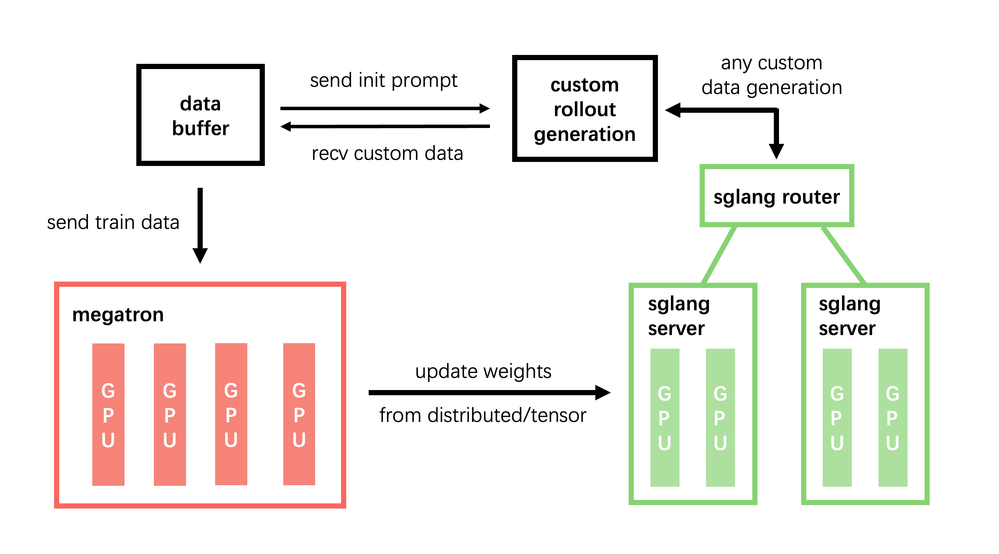

# slime

[English](./README.md)

[](https://thudm.github.io/slime/)
[](https://github.com/THUDM/slime/actions/workflows/pr-test.yml)
[](https://deepwiki.com/THUDM/slime)

**slime** 是为 RL scaling 设计的 LLM post‑training 框架，提供两大核心能力：

1. **高性能训练**：通过连接 Megatron 与 SGLang，支持各种模式的高效训练；
2. **灵活的数据生成**：通过自定义数据生成接口以及 server-based engine，实现任意训练数据生成流程。

slime 的设计目标，是让这两大能力彼此强化，同时避免把系统变成一组割裂的 trainer、rollout service 和 agent framework。Megatron training、SGLang rollout、custom data generation、reward computation、verifier feedback 和 environment interaction 都流经同一条 training / rollout / Data Buffer 路径。

这让 slime 成为最经受实战验证的开源 RL post-training 框架之一：它足够轻量、清晰、易扩展，同时也经过了 SOTA 级模型发布背后的完整训练闭环验证。

## 设计特点

- **生产实践**：slime 是 [GLM-5.3-Flash](https://z.ai/blog/glm-5.3-flash)、[GLM-5.3](https://z.ai/blog/glm-5.3)、[GLM-5.2](https://z.ai/blog/glm-5.2)、[GLM-5.1](https://z.ai/blog/glm-5.1)、[GLM-5](https://z.ai/blog/glm-5)、[GLM-4.7](https://z.ai/blog/glm-4.7)、[GLM-4.6](https://z.ai/blog/glm-4.6)、[GLM-4.5](https://z.ai/blog/glm-4.5) 背后的 RL 训练框架。
- **原生引擎集成**：直接使用 Megatron 参数，通过 `--sglang-` 前缀传入 SGLang 参数。
- **灵活的数据生成**：通过自定义接口接入生成函数、奖励函数、验证器和交互环境。
- **正确性与可靠性**：支持独立的 rollout 和训练调试、可复现性配置、故障恢复及 CPU/GPU 测试，服务长时间运行的实验。

## 支持的模型

除 GLM 系列外，slime 还支持 Qwen（Qwen3.6、Qwen3.5、Qwen3-Next、Qwen3 MoE、Qwen3、Qwen2.5）、DeepSeek（V3、V3.1、R1）和 Llama 3。模型配置见 [scripts/models](scripts/models/)，训练示例见[在线文档](https://thudm.github.io/slime/zh/)。

## 引擎配置与部署

可以直接使用 Megatron 的并行、优化器、checkpoint 和模型参数。当前安装版本的 SGLang 参数加上 `--sglang-` 前缀即可传入，例如将 `--mem-fraction-static` 写成 `--sglang-mem-fraction-static`。

复杂部署可参考：

- [SGLang 配置](docs/zh/advanced/sglang-config.md)：通过 YAML 配置服务器组、多模型服务和每组独立参数。
- [PD 分离](docs/zh/advanced/pd-disaggregation.md)：分开配置 prefill 和 decode 资源。
- [增量权重同步](docs/zh/advanced/delta-weight-sync.md)：通过共享存储传输发生变化的权重字节。
- [外部 rollout 引擎](docs/zh/advanced/external-rollout-engines.md)：接入训练任务之外管理的推理进程，并支持通过磁盘在不同 GPU 集群之间更新权重。

## 正确性、稳定性与 CI

CPU 测试覆盖核心行为和自定义接口约定；GPU 测试覆盖 dense/MoE 训练、rollout 部署、checkpoint、精度、全异步 rollout、蒸馏和调试回放。测试矩阵与运行方法见 [CI 指南](docs/zh/developer_guide/ci.md)。

相关工程文档：[调试](docs/zh/developer_guide/debug.md)、[可复现性](docs/zh/advanced/reproducibility.md)、[故障恢复](docs/zh/advanced/fault-tolerance.md)、[调用追踪](docs/zh/developer_guide/trace.md)和[性能分析](docs/zh/developer_guide/profiling.md)。

## 博文

- [slime：为 RL Scaling 设计的 SGLang-Native 后训练框架](https://thudm.github.io/slime/zh/blogs/introducing_slime.html)
- [Agent-Oriented Design: An Asynchronous and Decoupled Framework for Agentic RL](https://www.notion.so/Agent-Oriented-Design-An-Asynchronous-and-Decoupled-Framework-for-Agentic-RL-2278e692d081802cbdd5d37cef76a547)
- [slime v0.1.0：重新定义高性能 RL 训练框架](https://thudm.github.io/slime/zh/blogs/release_v0.1.0.html)

## 目录

- [架构总览](#架构总览)
- [快速开始](#快速开始)
- [基于 slime 构建的生态](#基于-slime-构建的生态)
- [参数说明](#参数说明)
- [代码阅读路线](#代码阅读路线)
- [开发指南](#开发指南)
- [常见 Q&A 与致谢](#常见-qa-与致谢)

## 架构总览



**模块说明**：

- **training (Megatron)**：负责主训练流程，从 Data Buffer 读取数据，训练完后将参数同步至 rollout 模块；
- **rollout (SGLang + router)**：生成新数据（含 reward/verifier），存储至 Data Buffer；通过 custom generate 可以在其上叠加 multi-turn loop、tool call、environment/sandbox 交互以及 verifier-based reward；
- **data buffer**：桥梁模块，管理 prompt 初始化、自定义数据与 rollout 生成方法（包括以同一套接口产出 sample 的 agentic workflow）。

默认通过 Ray `object-store` 传输数据。选择 `--rollout-data-transport straw` 后，通过 [straw](https://github.com/zhuzilin/straw) 在 JuiceFS 共享存储上持久化 提示任务、rollout 续生成状态和训练批次。Ray 传递控制消息和引用，生成与训练进程直接并行读写数据。详见 [straw 使用与恢复指南](docs/zh/advanced/straw.md)。

## 快速开始

有关环境配置、数据准备、训练启动和关键代码分析的完整快速开始指南，请参考：

- [快速开始指南](./docs/zh/get_started/quick_start.md)

我们还提供了一些未在快速开始中覆盖的使用示例，请查看 [examples](examples/)。

### Agentic RL 示例

以下智能体训练示例通过自定义接口接入标准的 rollout 和数据缓冲区：

- [`examples/multi_agent`](examples/multi_agent/README.md)：在标准 rollout 循环内通过 `--custom-generate-function-path` 实现多智能体生成。
- [`examples/search-r1`](examples/search-r1/)：通过 `--custom-generate-function-path` 实现搜索/RAG 风格的多轮生成。
- [`examples/fully_async`](examples/fully_async/README.md)：全异步 rollout，适合样本生成耗时差异较大的长尾任务。
- [`examples/coding_agent_rl`](examples/coding_agent_rl/README.md)：端到端代码智能体 RL，包含沙盒工具调用、基于测试的奖励和 token 级训练轨迹。

如何为智能体工作流选择合适的接口，请参考 [自定义指南](docs/zh/get_started/customization.md)。

## 基于 slime 构建的生态

以下独立项目基于 slime 开展模型后训练、智能体训练、领域应用和 rollout 系统研究。

### Dressage

[Dressage](https://github.com/Accio-Lab/Dressage) — Alibaba Accio 构建的智能体 RL 框架，通过 Paddock、Sandbox 和 Proxy 分离交互语义、执行位置与 token 级轨迹记录，支持黑盒智能体和多种沙盒环境。

### Miles

[Miles](https://github.com/radixark/miles) — RadixArk 构建的大模型后训练框架，在 slime 基础上扩展 SGLang 集成、部署与运维工具，以及 LoRA、TITO 和低精度训练。

### vime

[vime](https://github.com/vllm-project/vime) — 由 vLLM 项目维护的后训练框架，保留 slime 的 Megatron 训练和数据生成设计，使用 vLLM 与 vllm-router 进行 rollout。

### Relax

[Relax](https://github.com/redai-infra/Relax) — RedAI Infra 构建的多模态智能体 RL 框架，通过 Ray Serve、TransferQueue 和异步 checkpoint 同步，将训练、rollout 与教师模型、参考模型计算部署在独立资源上。

### OpenClaw-RL

[OpenClaw-RL](https://github.com/Gen-Verse/OpenClaw-RL) — 利用对话反馈训练个性化 OpenClaw 智能体，通过 GRPO 或 on-policy distillation 优化模型，同时提供 API 推理服务。

### P1

[P1](https://prime-rl.github.io/P1/) — 通过多阶段 RL、自适应任务难度和训练稳定化方法训练物理推理模型。

### RLVE

[RLVE](https://github.com/Zhiyuan-Zeng/RLVE) — 在 400 个程序化生成、可验证的环境中进行联合 RL 训练，并根据当前策略动态调整任务难度。

### TritonForge

[TritonForge](https://github.com/RLsys-Foundation/TritonForge) — 先进行 SFT，再结合多轮编译反馈进行 RL，训练生成高性能 GPU kernel 的模型。

### APRIL

[APRIL](https://github.com/RLsys-Foundation/APRIL) — 通过增加并行请求和主动管理部分生成结果，缓解长尾采样造成的 rollout 吞吐瓶颈。

### qqr

[qqr](https://github.com/Alibaba-NLP/qqr) — 结合 ArenaRL 锦标赛排序和 MCP 工具环境，开展开放式智能体训练。

### ART

[ART](https://github.com/awslabs/agentcore-rl-toolkit) — 在 AWS Bedrock AgentCore Runtime 上训练生产智能体的 SDK，复用现有工作流，在模型网关记录训练轨迹，并将 slime 作为训练后端选项。

## 参数说明

参数分为三类：

1. **Megatron 参数**：slime 会直接读取 Megatron 参数，可以通过传入如 `--tensor-model-parallel-size 2` 的方式配置 Megatron；
2. **SGLang 参数**：支持当前环境中安装版本 SGLang 的所有参数，这些参数需要以 `--sglang-` 起始，例如 `--mem-fraction-static` 需要通过 `--sglang-mem-fraction-static` 传入。
3. **slime 自身的参数**：请见：[slime/utils/arguments.py](slime/utils/arguments.py)

完整使用说明请查阅 [使用文档](docs/zh/get_started/usage.md)。

## 代码阅读路线

建议从训练主循环出发，再按需求逐层追踪：

```text
train.py: train
├─ slime/ray/placement_group.py       Ray 资源和 worker 初始化
├─ slime/ray/rollout.py              RolloutManager.generate：rollout 编排
│  └─ slime/rollout/sglang_rollout.py  Sample 生成和 reward 计算
└─ slime/ray/actor_group.py          RayTrainGroup.async_train：调度训练
   └─ slime/backends/megatron_utils/actor.py
      ├─ model.py                    Megatron 模型执行
      └─ loss.py                     RL loss 和 advantage 计算
```

首次阅读时，可以先把 `slime/utils/arguments.py` 当作配置入口。`slime/backends/sglang_utils/` 里的部署细节，以及 `slime/backends/megatron_utils/update_weight/` 里的权重同步实现，也可以等需要修改对应功能时再读。

## 开发指南

- 提交 Issue 或 PR 前，请先阅读[贡献指南](CONTRIBUTING.md#开源协作范围说明)。

- 使用 [pre-commit](https://pre-commit.com/) 保证提交代码风格：

  ```bash
  apt install pre-commit -y
  pre-commit install

  # 运行 pre-commit 保证代码风格
  pre-commit run --all-files --show-diff-on-failure --color=always
  ```

- 调试技巧请参考 [调试指南](docs/zh/developer_guide/debug.md)

## 常见 Q&A 与致谢

- 常见问题请见 [Q&A](docs/zh/get_started/qa.md)
- 特别感谢以下项目 & 社区：SGLang、Megatron‑LM、mbridge、OpenRLHF、veRL、Pai-Megatron-Patch 等。

- 引用 slime 请使用：
```bibtex
@misc{slime_github,
  author       = {Zilin Zhu and Chengxing Xie and Xin Lv and slime Contributors},
  title        = {slime: An LLM post-training framework for RL Scaling},
  year         = {2025},
  howpublished = {\url{https://github.com/THUDM/slime}},
  note         = {GitHub repository. Corresponding author: Xin Lv},
  urldate      = {2025-06-19}
}
```
