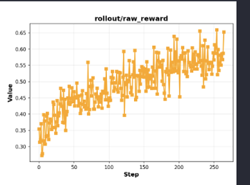

# FSDP + VLM Single-Turn RL

Training VLMs with FSDP on single-turn reasoning task using GRPO on the [GEO3K dataset](https://huggingface.co/datasets/hiyouga/geometry3k). We used processed version [here](https://huggingface.co/datasets/chenhegu/geo3k_imgurl).



## Reproduce

```bash
export WANDB_API_KEY=your_wandb_api_key

SLIME_SCRIPT_MODEL_NAME=Qwen3-VL-2B-Instruct SLIME_SCRIPT_EXTERNAL_RAY=1 SLIME_SCRIPT_NUM_GPUS=8 python examples/geo3k_vlm/run_geo3k_vlm.py 2>&1 | tee run_simple.log
```

## Notes

The GEO3K dataset has some ground truth answers that are not exact, because they are rounded to just 1 or 2 decimal places (for example, the true answer might be `8/15`, but the ground truth is recorded as `0.53`). To handle this, the reward model checks if the model’s predicted answer is within 0.05 of the ground truth value if the value does not match in string space. This allows for occasional rounding discrepancies in the label data. These cases are rare, so using this tolerance does not cause the reward model to frequently give incorrect high rewards.